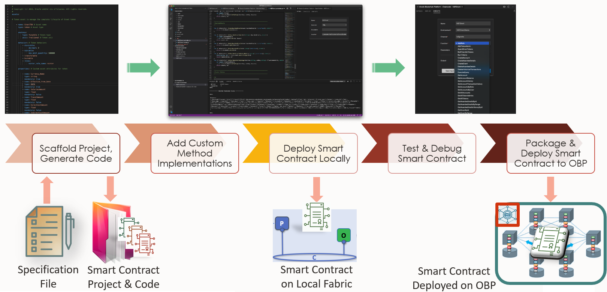
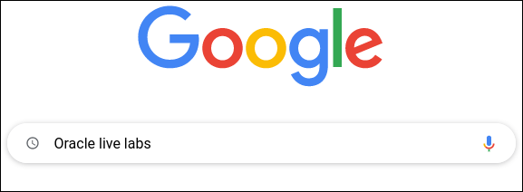
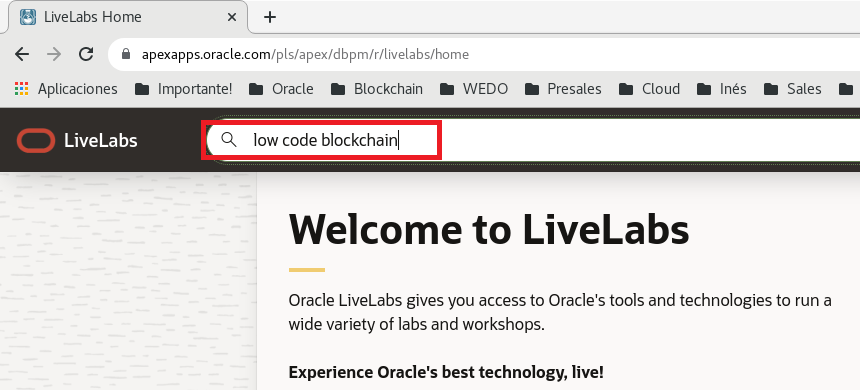
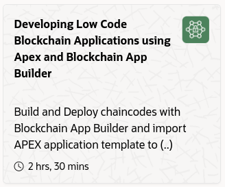
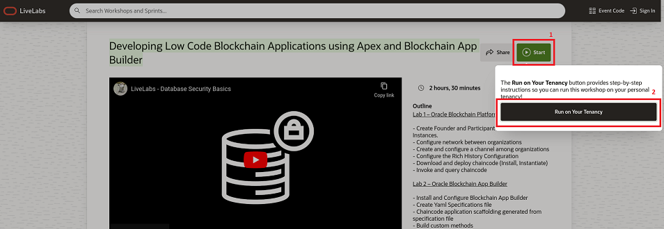
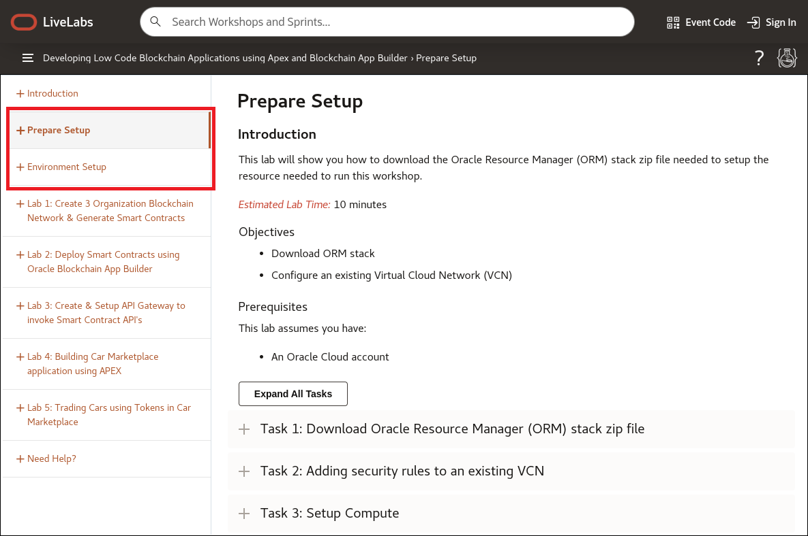
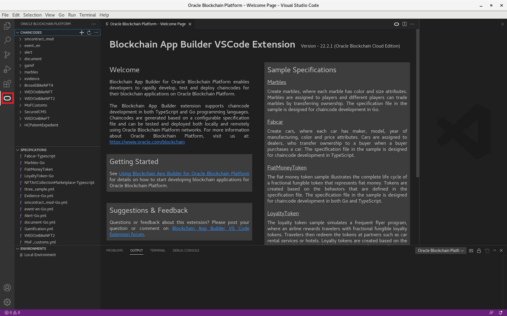

# Preparation of Oracle App Builder development environment

The creation of an Hyperledger Fabric (HLF) Smartcontract is somehow a quite complex task, you need to know all the intrinsics about HLF, you need to know how to code in Java, Typescript, or GoLang, and you also need to know how to deploy and manage the whole lifecycle of the Smartcontract project.

AppBuilder has been created to simplify the creation of an smartcontract project, in fact AppBuilder is a low-code tool which is able to create the whole Chaincode project from scratch, excluding obviously any custom code required by your business case. A part of that, AppBuilder will also help you in the testing phases, packaging of the project, and also, in the deployment of the chaincode locally in your own PC for unitary testing, or remotely into a real Hyperledger Fabric Network.

<p align="center"  alt="App Builder in VSCode">

</p>

AppBuilder has been created in two flavors, you can use it as a command line tool aimed to automate CI/CD processes, or you can use it as a Microsoft Visual Code Pluging. Both of them will allow you to execute exactly the same functionality, just select the one you prefer depending on what are your preferences as developer.

To help to understand the benefit of AppBuilder, we can highlight the following features:
- ***In development phase*** AppBuilder will create the whole chaincode project just creating what is known as a customized specification file. The project will include all the coded entities, all their accessors together with all the CRUD methods to manage those entities, and also the signature of any custom method required for any non-standard or complex busines logic required by your application, which will become the only code needed to be manually implemented.
- ***Deployment of the chaincode***: Once the chaincode project is ready to be tested you can deploy it locally into the local pre-configured Hyperledger Fabric Network, or remotely to any existing Oracle Blockchain Platform instance, no matter if it is in cloud or onPremises. Another option is to package the project to be deployed manually through the Oracle Blockchain console.  
- ***In testing phase***: Once the project has been deploye you can test very easily any of the auto-generated methods or the custom methods of the chaincode project.
- ***Debug the chaincode***: In case you were using the Visual Studio Code extension, you will also be able to perform line-by-line debugging of the chaincode. 

You can install whatever of the two available versions of AppBuilder in your own computer by following the below instructions:
- If you want to use AppBuilder as a Microsoft Visual Studio plugin, follow the instructions from [Install and Configure the Blockchain App Builder Extension for Visual Studio Code](https://docs.oracle.com/en/cloud/paas/blockchain-cloud/usingoci/install-and-configure-dev-tools-vs-code-extension.html "Install and Configure the Blockchain App Builder Extension for Visual Studio Code")
- If you prefer to use AppBuilder as a command line tool, follow the instructions from [Install and Configure Blockchain App Builder CLI](https://docs.oracle.com/en/cloud/paas/blockchain-cloud/usingoci/install-and-configure-dev-tools-cli.html "Install and Configure Blockchain App Builder CLI")
  
In other hand, if you are not confortable installing in your laptop this kind of development tools and all their dependencies, but you have access to Oracle Cloud, you can opt to create a dedicated development box with all these products already installed and prepared to be used in the cloud, and access to it remotely. This kind of machine uses to be really cheap because the compute shape required, and because they are only billed while they are up and running.

If you prefer to go for this last option, in Oracle LiveLabs you have a Lab in which you will be able to deploy a remote machine in minutes, based on a VM image already preconfigured by the Oracle Blockchain development team. Follow below instructions to proceed in this way:
1. Search in Google for ***Oracle Live Labs***.
<p align="center"  alt="Select The compartment where the instance of the founder organization will be created">

</p>

2. Push the first link, and in the Oracle LiveLabs page search for ***Low Code Blockchain*** labs.
<p align="center"  alt="Select The compartment where the instance of the founder organization will be created">

</p>

3. Select the ***Developing Low Code Blockchain Applications using Apex and Blockchain App Builder*** lab.
<p align="center"  alt="Select The compartment where the instance of the founder organization will be created">

</p>

4. Push the ***Start*** button to start the lab, and the select the only option you have to execute this lab ***Run on your tenant***.
<p align="center"  alt="Select The compartment where the instance of the founder organization will be created">

</p>

5. Once you are inside the Lab, to get a cloud machine ready whith Visual Code Studio, and with the AppBuilder low code plugin installed on it, you only need to execute the ***Prepare Setup*** and ***Environment Setup*** steps, which should not take more than 25 minutes in total. 
<p align="center"  alt="Select The compartment where the instance of the founder organization will be created">

</p>

All this work does not have too much relation with the objective of the HoL, but is something needed to be able to get an environment ready to use the low code tooling needed to begin to develope your smartcontracts.

Once you have executed one of the three methods exposed before, you should be able to access Oracle AppBuilder through Visual Studio...
<p align="center"  alt="App Builder in VSCode">

</p>

... or by issuing the command line tool...

```
[jvillena@localhost ~]$ ochain

Usage: <command> [options]

Options:

  -h, --help       output command usage information
  -v, --version    display command version number
  -D, --debug      enable debug logging

Commands:

  deploy     Deploy chaincode project to Oracle Blockchain Platform
  init       Initialize a new Chaincode project
  invoke     Invoke a Chaincode transaction
  package    Package and archive an Ochain chaincode project
  patch      Apply PatchFix to ochain
  query      Invoke a Chaincode Query
  run        Run chaincode project locally in debug mode
  stop       Shutdown all chaincode services
  sync       Synchronize Changes from spec file to the required chaincode
  upgrade    Upgrade App Builder chaincode project


About:

  Version: 22.2.1 (Oracle Blockchain Cloud Edition)
  Copyright © 2022, Oracle and/or its affiliates. All rights reserved.
  ```

