# Creation and Deployment of the SmartContract

#### Table of Contents  
[Introduction](#Introduction)  
[Creation of the Smartcontract project](#CreationNFTchaincode)  
[Deployment of the Smartcontract](#DeploymentNFTchaincodeFounder)  
[Smartcontract Initialization](#InitializeNFTchaincode)  

<a name="Introduction"/>

## Introduction
In this chapter we are going to explain the steps to create the smartcontract in which all the logic required for our business case will be placed. 

First of all we need to define the entities to be stored and managed in Blockchain. Basically the entities modeled in this picture:
<p align="center">
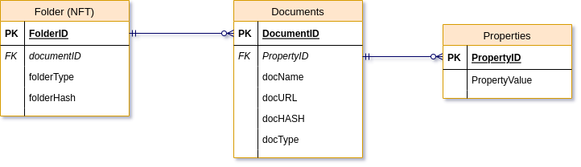
</p>

In the Smartcontract will be defined all these entities and their relations, and also all the logic required to manage and interact with the entities, and also to persist them into the blockchain ledger.

As already explained, the ***folder*** will be represented as an NFT token, so it will be developed and initialized as and NFT. The other dependent entinties (Docuemnts and Properties), are standard entities and are child entities of the folder, so it will be developed as standrd entieties with out the need of initialize in any sense.

Once the smatcontract gets created, we will install and deploy it in the Blockchain Network created in the first chapter.

<a name="CreationNFTchaincode"/>

## Creation of the Smartcontract Contract
Once you have AppBuilder ready to be used, you can begin to create what is named the ***specification file***. The specification file can be created as a simple YAML file. Here below you can see the specification file needed to create our smartcontract:

```yaml
#
# Token asset to manage the complete lifecycle of a non-fungible token representing a folder to hold docuements. 
# This specification file will generate an Smartcontract project with a non-fungible token for the folders to be maintained by the users.
#
assets:
    - name: folderNFT
      type: token
      symbol: eDocs
      standard: erc721+
      anatomy: 
        type: nonfungible
        unit: whole
      behavior:
        - indivisible
        - singleton
        - mintable:
        - transferable
        - burnable
        - roles:
            minter_role_name: minter
      properties:
          - name: folderHASH
            type: string
          - name: documents
            type: document[]
      metadata:
          - name: folderID
            type: string
            mandatory: true
            id: true
          - name: folderType
            type: string
            mandatory: true
      methods:
        crud: [create, getById, update, delete]
        others: [getHistoryById, getByRange]
    - name: document
      properties:
        - name: docName
          type: string
          mandatory: true
          id: true
        - name: docURL
          type: string
          mandatory: true
        - name: docHASH
          type: string
          mandatory: true
        - name: docType
          type: string
          mandatory: true
        - name: docProperties
          type: docProperty[]
      methods:
        crud: [create, getById, update, delete]
        others: [getHistoryById, getByRange]
    - name: docProperty
      type: embedded
      properties:
          - name: propName
            type: string
            mandatory: true
          - name: propValue
            type: string
            mandatory: true
      methods:
        crud: [create, getById, update, delete]
        others: [getHistoryById, getByRange]
customMethods:
    - executeQuery
    - "attachDocument(tokenId: string, docName: string, docURL: string, docHASH: string, docType: string, docProps: string[], docVals: string[])" # Attach a document to an existing folder. 
    - "retrieveDocuments(tokenId: string)" # Retrieve Documents of an folder. 
    - "transferFolder(tokenId: string, fromOrgId: string, fromUserId: string, toOrgId: string, toUserId: string)" # Transfer the folder among participants. 
    - "updateFolderHASH(tokenId: string, newHash: string)" # Update HASH folder 
    - "getFolderHASH(tokenId: string)" # Check HASH folder 
```

You can download this specification file from [WEDOCMS.yml](./src/WEDOCMS.yml). 

In this specification file, in the first entity defined (folderNFT) you can see all the sections and attributes for a representation of an NFT token. Just as a first overview of the sections defined in the file: 
- ***Assets***: Place where the different assets (standard entities, FTs, NFTs) are defined. Inside each of the assets we can distingish different sections which can vary depending on the kind of represented asset. For NFTs and FTs these are the different subsections:
  - ***Type/Symbol/Standard***: You must indicate in these properties that this token is based in the ERC-721 Standard, and give to it a unic symbol indentifier.
  - ***Anatomy***: In this section you specify it is a non-fungible token (NFT) and whether it would be subdivided into smaller fractions (nowadays "whole" is the only option for NFT tokens).
  - ***Behavior***: In this section is where must be defined if the token can be minted, and in such case, which is the maximum number of mintable tokens. Here you must also state it is an indivisible token, if is singleton for each class, transferable, and burnable which is similar to its deletion, but not disapearing, so it is still there but not usable at all. Also in this section you can restrict token behaviors to specific roles.
  - ***Metadata***: This section define a sort of prpoperties which must be set during token creation, and can not be changed in the future. So its value will remain inmutable for the whole life of the token.
  - ***Properties***: Standard attributes of the token which can vary during the life of the token, like the array of documents who compose the folder. 
- ***customMethods***: location where the list of our custom methods must be defined. For those methods AppBuilder will only generate the signature of the method, without any implementation on them. The implementation of these methods are the only code the be implemented by the developer.

In the following link you can see how to configure any kind of entity (NFT, FT, or standard entities) based in your business needs:
- For standard entities you can see in [How to create an Input Specification File](https://docs.oracle.com/en/cloud/paas/blockchain-cloud/usingoci/input-configuration-file.html) all the details about how to create it.
- If you want to create an entity represented as a Non-Fungible Token you can see in [Input Specification File for Non-Fungible Tokens](https://docs.oracle.com/en/cloud/paas/blockchain-cloud/usingoci/input-specification-file-non-fungible-tokens.html) how to define it. 
- If what you want to create is an entity represented as a Fungible Token you can see [Input Specification File for Fungible Tokens](https://docs.oracle.com/en/cloud/paas/blockchain-cloud/usingoci/input-specification-file-fungible-tokens.html) how to define it.

Once the Specification file has been created we can mandate AppBuilder to create the scaffold of the project by following the next steps:

1. If the Specification File has been created outside of App Builder, first of all we will need to import the Specification file into AppBuilder. Push the three dots (***...*** on the upper-right corner of the ***SPECIFICATIONS*** frame of AppBuilder, and from the popup click in the ***Import Specification***: 
<p align="center">
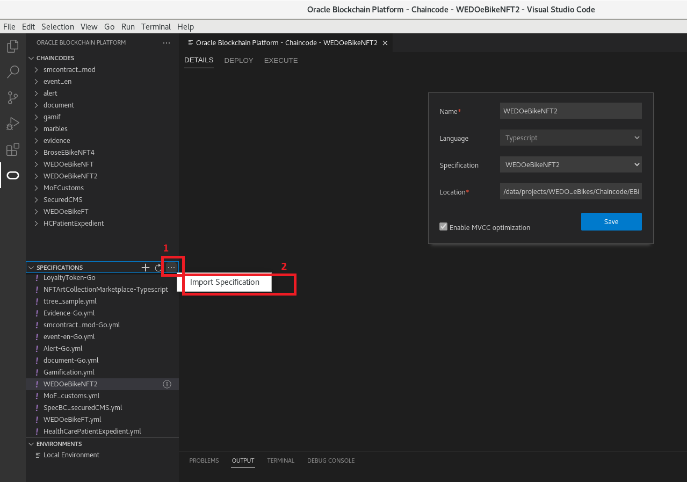
</p>

2. Select the specification file just created, and push the button ***Import Specification***.
<p align="center">
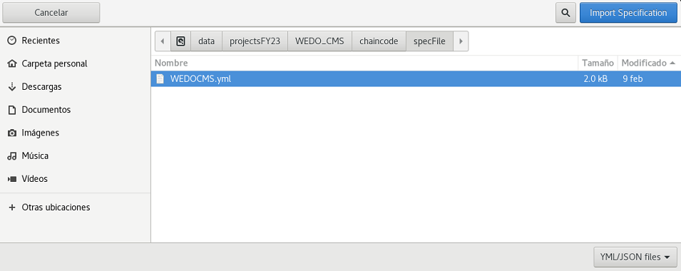
</p>

3. To be able to create a new chaincode project based on the imported specification file, we must push the plus icon (***+*** on the upper-right corner of the ***CHAINCODES*** frame of AppBuilder. It will open the ***Create Chaincode*** wizard: 
<p align="center">
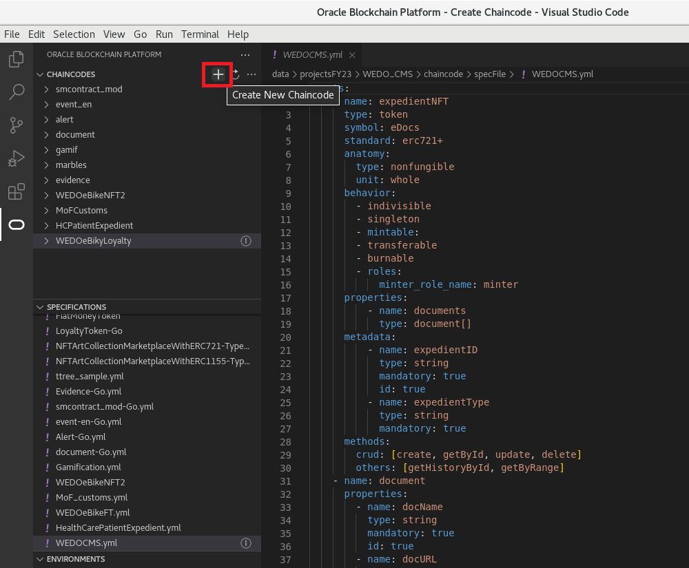
</p>

4. In the ***Create Chaincode*** wizard you must specify the following details, and after specifying the details push the ***Create*** button:
 - **Name**: name for the project.
 - **Language**: In which language you want AppBuilder creates the scaffold of the project. Nowadays you can only select between Typescript and GoLang. As we are providing in Typescript the implementation of the custom methods, we recomend here to select the same language (Typescript).
 - **Specification**: You must select the specification file we just created in the previous steps.
 - **Location/Domain**: Depending on the selected language you will be prompted to define the location where the project will be placed for the Typescript language, or the domain for the GoLang language.  

<p align="center">
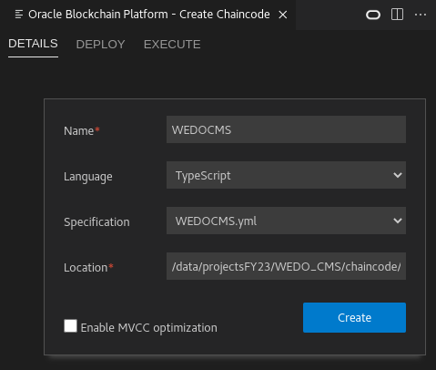
</p>

5. If everything goes fine, we should see a green message in the wizard. If this is not the case we should check the output generated during the creation of the scaffold of the project:
<p align="center">
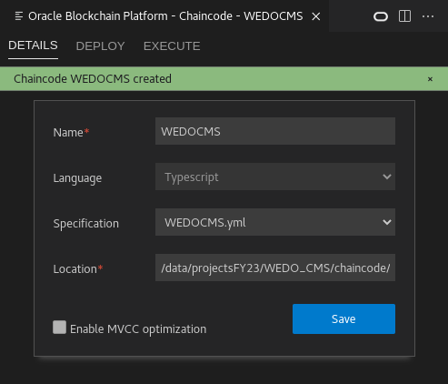
</p>

6. In the ***CHAINCODES*** section we should see the new generated project (in my case: eShopDeviceNFT). Clicking in the project, we should be able to navigate to the src folder inside the project, where the source code has been generated:

   - Inside the ***src/controller*** folder we will see the main class representing our smartcontract, with all the autogenerated methods to manage our entities.
   - Inside the ***src/model*** folder we will see the class representing the NFT entity.

<p align="center">
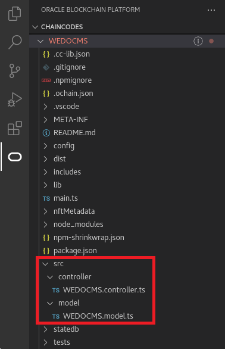
</p>

7. Going to the folder ***src/controller***, and selecting the controller class, we will see all the code auto-generated by AppBuilder, and going to the end of the file, we will see all the signatures of the custom methods without any implementation on them:
<p align="center">
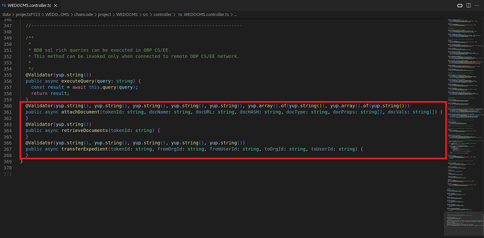
</p>

8. At this point we should create the implementation of these custom methods. For simplicity we provide all the implementation for such methods in the  file [CMS_customMethods.ts](./src/CMS_customMethods.ts) , so we only need to substitute the signatures autogenerated by AppBuilder, by the content on the referenced file.

The Controller class, lines before the custom methods, includes all the auto-generated code to manage the lifecycle of the NFT tokens. The following picture depicts the different areas covered by such methods:
<p align="center">
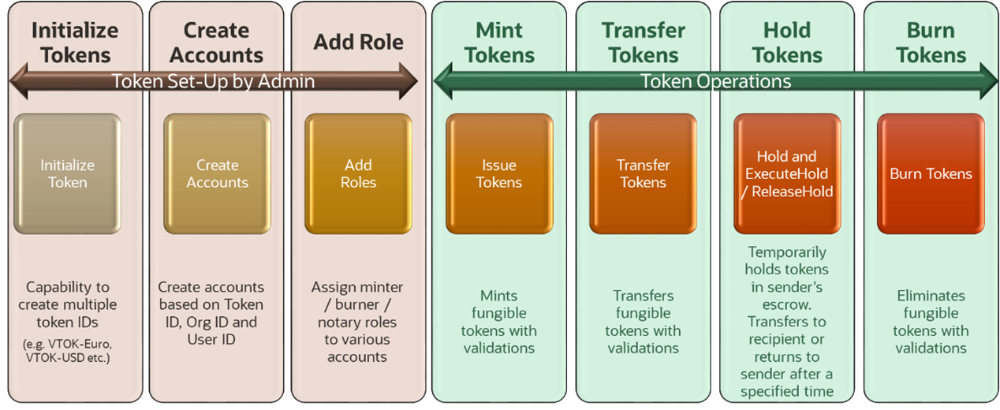
</p>

At this point the chaincode is ready to be used, so we can deploy and test the chaincode locally by following the instructions from [Test Your Chaincode on a Local Hyperledger Fabric Network](https://docs.oracle.com/en/cloud/paas/blockchain-cloud/usingoci/test-your-chaincode-using-visual-studio-code.html) link. 

<a name="DeploymentNFTchaincodeFounder"/>

## Deployment of the NFT Smartcontract into the Founder Instance

Once you have tested locally the chaincode, we can proceed by deploying it in the real network we previously created using the Oracle Blockchain Service Console. The summarize of the actions to be executed are:
 - Package the chaincode project.
 - Install and Deploy the chaincode package into the single instance (founder).

1. First of all we must create the deployable package from the chaincode project. From Visual Studio, push the right button on top of the name of the chaincode project, from the popup menu select the ***Package*** option, and select the directory to save the chaincode package file:
<p align="center">
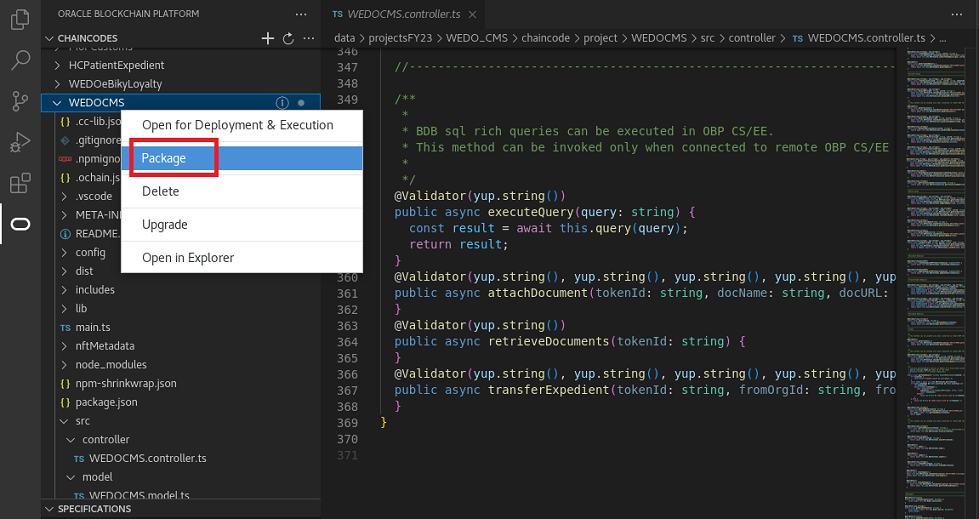
</p>

2. Now we are going to access to the ***Oracle Blockchain Service Console*** to install and deploy the chaincode package into the Founder instance:
   - https://'<InstanceName>'-'<RegionName>'.blockchain.ocp.oraclecloud.com:7443/
     -  note: Remember how you can get the Oracle Blockchain Services Console URL:
        - In the OCI services menu, select ***Developer Services*** and click on ***Blockchain Platform***
        - Ensure that the right Compartment is selected and click on the founder instance.
        - Click the ***Service Console*** console button.

3. Navigate to the ***Chaincode*** tab, and push the ***Deploy a New Chaincode*** button:
<p align="center">
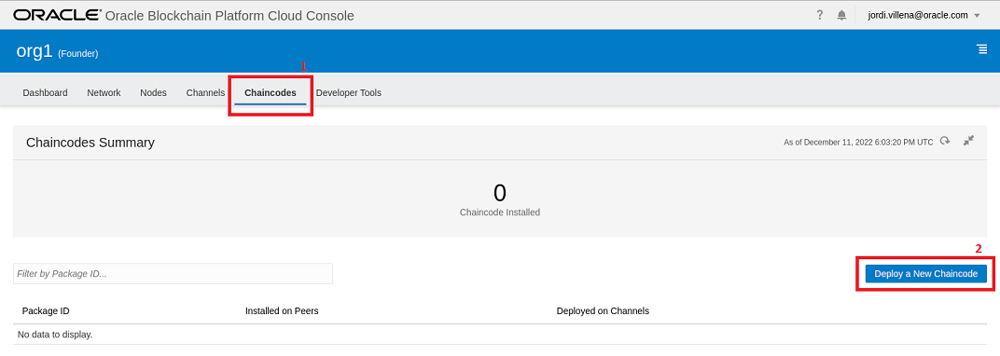
</p>

4. Select the ***Advanced Deployment*** option:
<p align="center">
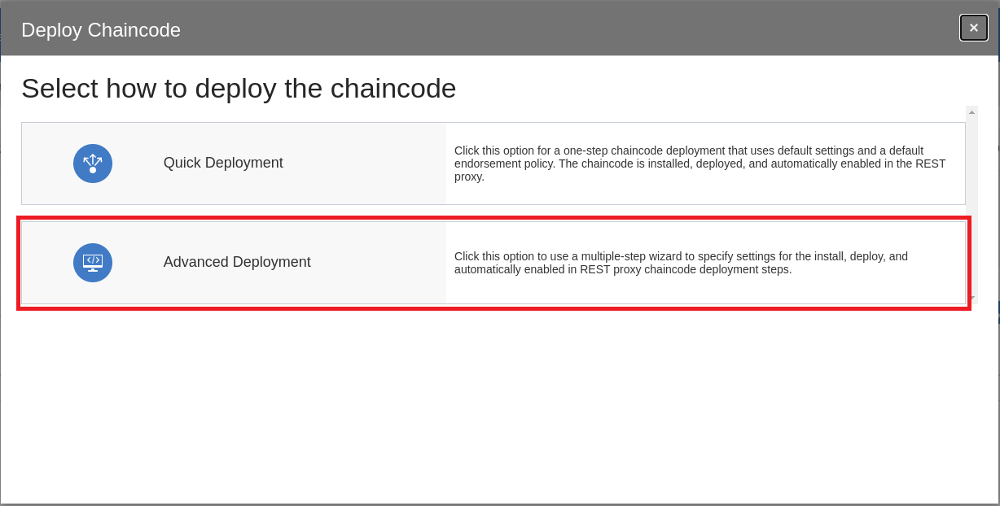
</p>

5. Set all the values to Install the chaincode package into the Founder instance and push the ***Next*** button:
   - **Package Label**: Give a name which can help you identify which package is installed in the different existing channels. As you can have more than one version of the same smartcontract deployed in different channels, it is a good practice to set a label like: 

   ```
   <smartContractName>_<channel>_<version>
   ```

   - **Chaincode Language**: Select among the different languages, based in the language in which you have developed the chaincode.
   - **Target Peers**: Select the peers in which you want to install the chaincode package.
   - **Is Packaged Chaincode**: Leave this box unselected if what you are going to upload is a zip file. Select the checkbox for tar.gz files.
   - **Chaincode Source**: Push the ***Upload Chaincode File*** to be able to navigate in your file system to select the chaincode zip file.  
<p align="center">
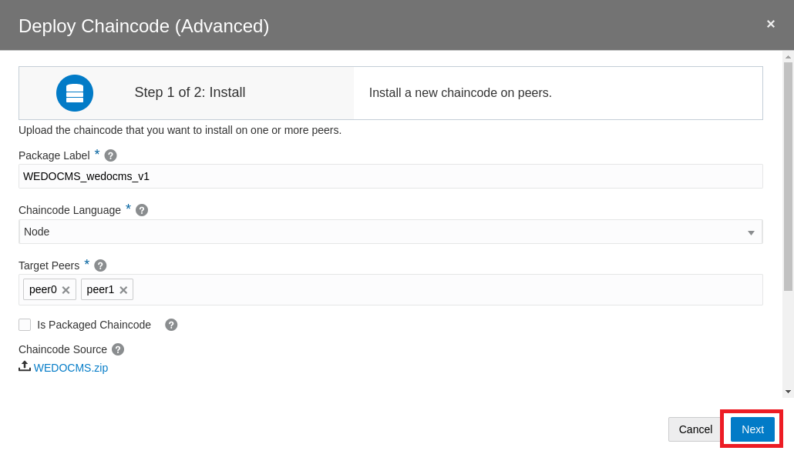
</p>

6. If the installation succeed we will see the below success message. Then, next step is the deployment of the chaincode in the selected channel, so you must set all the values related with the deployment phase and push the ***Next*** button:
   - **Channel**: Select the channel in which you want to deploy the smartcontract. 
   - **Chaincode Name**: Set the name with which the smartcontract will be deployed on the channel. 
   - **Version**: Asign a number to this deployment, which is aligned with the installed package installed before. In this way you will be able to correlate packages installed with chaincodes deployed in the different channels.
   - **Init-required**: Select this checkbox if the init method of the chaincode needs to be invoked before allow user transactions.
   - **Endorsement Policy**: You can specify Endorsment policies during deployment, but for the purpose of this HoL we do not need them.
   - **Private Data Collection**: You can set Private Data Collections, but for the purpose of this HoL we do not need them.
<p align="center">
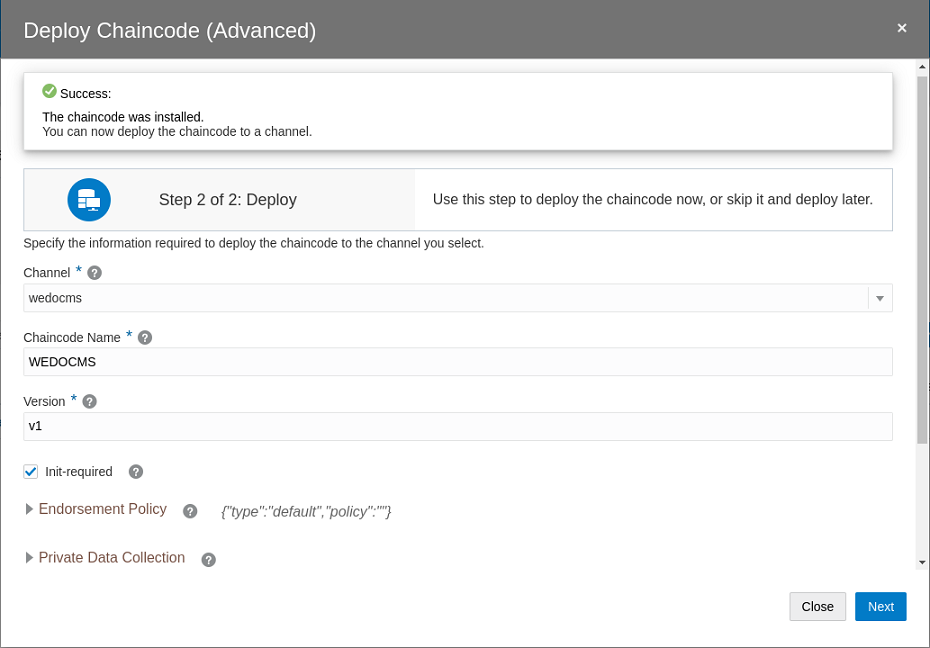
</p>

7. If the deployment succeed, after closing the installation and deployment, you should see how the package has been installed in the two peers of the instance, and also instantiated in one of the channels:
<p align="center">
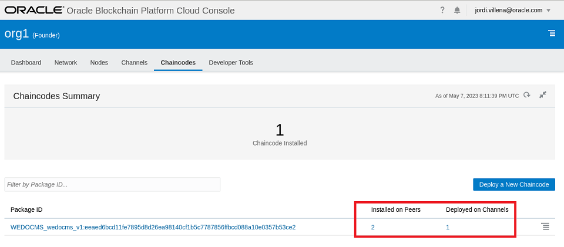
</p>


<a name="InitializeNFTchaincode"/>

## Initialization of an NFT Smartcontract

When you are dealing with FTs and/or NFTs Tokens, there is a bunch of administrative actions to be executed before being able to execute your business methods. Thanks to Oracle Blockchain, all this administrative tasks can be executed as simple REST calls, so it simplify considerably the effort needed for the Smartcontract initialization.

---

IMPORTANT: Before the execution of any of the below steps we must create the enrollmentIDs into the REST Proxies for those users granted to access to the smartcontract methods. The enrollment is a mapping between the username who invoke the REST API, and the accounts managed internally by blockchain to which tokens will be assigned.
The enrollment creation has already been done at the end of the first chapter, [Create Enrollments in the REST Proxy nodes](../1-create-network#createEnrollments).

---

## Prepare Postman Collection to execute REST APIs
A Postman collections has been created to make more easy the initialization of the Smartcontract.

In the ***AdminSteps*** folder of this <a id="raw-url" href="./src/WEDO_BlockchainCMS.postman_collection.json">Postman collection</a> have been created the three request calls to be executed for the Smartcontract initialization. 

The Postman collection is ready to be used, but there is a set of variable which needs to be configured adequated to your own environment (passwords, URLs, ...). These variables are set in the ***Variables*** tab of the Postman collection. 

The following table shows all the varibles we have defined and needs to be adapted to your environment:
| Variable Name               | Variable value        |
| --------------------------- |-----------------------|
| bc_founder_provider_url     | https://org1-w....    |
| bc_timeout                  | 60000                 |
| bc_nft_founder_userid1      | cmsleg001             |
| bc_nft_founder_userid1_pwd  | Oracle12345.          |
| bc_nft_founder_userid2      | cmsfin001             |
| bc_nft_founder_userid2_pwd  | Oracle12345.          |
| bc_nft_founder_userid3      | cmsrsk001             |
| bc_nft_founder_userid4_pwd  | Oracle12345.          |
| bc_channel_name             | wedocms               |
| bc_chaincode_name           | WEDOCMS               |

First of all we need to know which is the endpoint in which the REST API is accesible. You can get this URL from the Blockchain Service Console:
1. Access to the Blockchain Service Console through the OCI Console:
   - In the OCI services menu, select ***Developer Services*** and click on ***Blockchain Platform***.
   - Ensure that the right Compartment is selected and click on the founder or participant instance (the one you want to access through).
   - Click the ***Service Console*** button.  
2. Once inside the ***Service Console*** go to the ***Nodes*** tab. It will show you all the nodes which composes this instance, and in the ***restproxy*** node you will see the endpoint URL at the ***Route*** column: 
<p align="center">
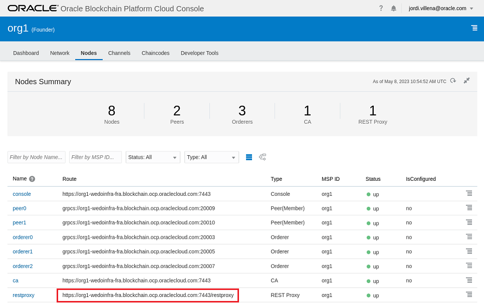
</p>

Remmember that enrollments are created at instance level, not network level, so the enrollment for cmsleg001 user will be only available through the restproxy URL of the founder instance, so, if new instances join the network, with new users allowed to access to the network, those users will need to exist in the proper tenancy, and the enrollments for those users should also be created in the restproxy of the corresponding instance. Following table shows the user to be used initialy in the founder instance:
| username        | Instance URL          |
| --------------- |-----------------------|
| cmsleg001       | https://org1-....     |
| cmsfin001       | https://org1-....     |
| cmsrsk001       | https://org1-....     |

Once Postman collection has been properly configured, we can proceed with the Smartcontract initialization. 

The initialization of an NFT Smartcontract is considerably simplier than the initialization of a FT Smartcontract, we just need to execute three steps:
1. Smartcontract initialization (Init Admin User Accounts).
2. Creation of wallets for users who can own the NFT tokens.
3. Asign minter role for those users who should have that privilege.


The following API REST calls correspond to the calls into the ***AdminSteps*** folder from the provided Postman collection:

1. The first action is the initialization of the chaincode (***Step-0: Init Admin User Account***) indicating which user accounts will be allowed to execute administrative tasks. It is important to set correctly the args of the init method:
   - ***args***: Scaped array of user_ids with their org_ids:

```JSON
{
    "chaincode": "{{bc_nft_chaincode_name}}",
    "args": [
        "init",
        "[{\"orgId\":\"org1\",\"userId\":\"cmsleg001\"},{\"orgId\":\"org1\",\"userId\":\"cmsfin001\"},{\"orgId\":\"org1\",\"userId\":\"cmsrsk001\"}]"
    ],
    "timeout": {{bc_timeout}},
    "isInit": true,
    "sync": true
}
```

<p align="center">
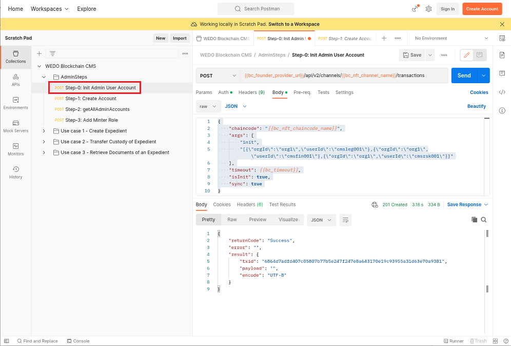
</p>

2. We must create user accounts for all the users who can be custodians of the NFT assets representing the physical assets. It can be done by executing the ***Step-1: Create account*** Postman request. For the specifics of our use case there is only three users related with the same single organization belonging to the network.
   - This call must be executed as many times as users for which we want to create an account. In our case 3 times, each with following params:
     - "createAccount", "org1", "cmsleg001", "nonfungible"
     - "createAccount", "org1", "cmsfin001", "nonfungible"
     - "createAccount", "org1", "cmsrsk001", "nonfungible"

```JSON
{
    "chaincode": "{{bc_nft_chaincode_name}}",                        //Smartcontract name
    "args": [
        "createAccount", "org1","cmsleg001","nonfungible"      //Method, OrgID, UserID, fungible for FT / nonfungible for NFT
    ],
    "timeout": 60000,
    "sync": true
}
```

<p align="center">
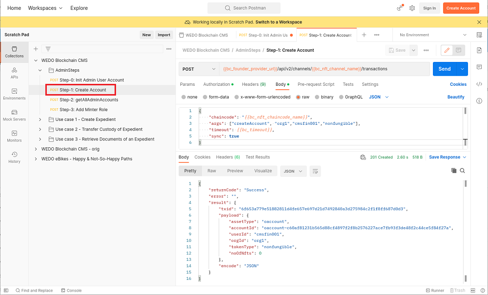
</p>

3. We can set which user is allowed to mint tokens, in this case ***mint a token*** means create a new folder to hold a new set of documents, so you can decide which of the three existing users (cmsleg001, cmsfin001, or cmsrsk001) can execute this actions, and for those users execute the request ***Step-2: AddRole*** from the Postman colletion:
  - Sample Request Payload

```JSON
{
    "chaincode": "{{bc_nft_chaincode_name}}",        //Smartcontract name
    "args": [
        "addRole",                                   //Method name
        "minter","org1","cmsleg001"                  //Role, OrgId, UserID
        ],
    "timeout": 60000,
    "sync": true
}
```

<p align="center">
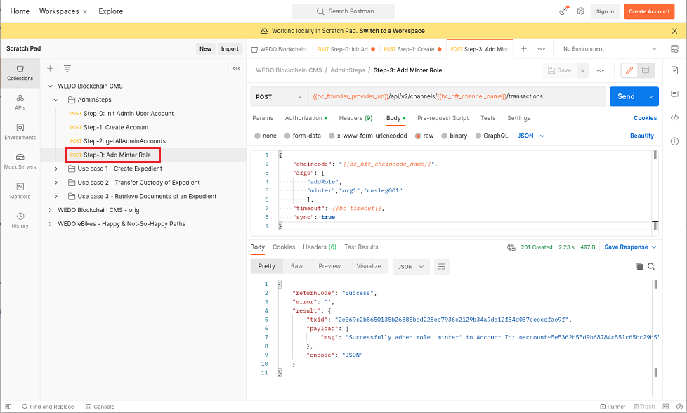
</p>

 
