# Configuration, Deployment, and Test of the Web Application.

A Web Application has been developed and can be downloaded [here](./src/WEDO_CMS_1_0-1.0.1.zip). This application has been configured to point to a different Blockchain network and a different bucket, so you should do a few changes to be able to use this application pointing to your Blockhain Network and to the bucket you created in the previous chapter.

First of all we are going to acces to your Visual Builder Studio instance, where we will be able to import the provided Web Application. 

<a name="AccessVBS"/>
<details>
  
  <summary>1. Acces to Visual Builder Studio (click to show)</summary>
  
## 1. Acces to Visual Builder Studio

---
Visual Builder is not only used to develop Visual Builder applications, but it allows the development of any kind of modern application thanks to its multitude of integrated development tools, such as a GIT repository, CI/CD pipelines engine, artifact generation, container repository, agile tools, team building tools like wiki and snipples and more. If you want to know more please click [here](https://www.oracle.com/application-development/visual-builder-studio/)
	  
---
To get access to Visual Builder Studio (VBS) you have to Sign-in Oracle Cloud web console with your tenancy user credentials. Then Click in the *hamburguer icon* in the top left part of the web console and select **OCI Classic Services** then click in **Developer** to access to Visual Builder Studio instance.

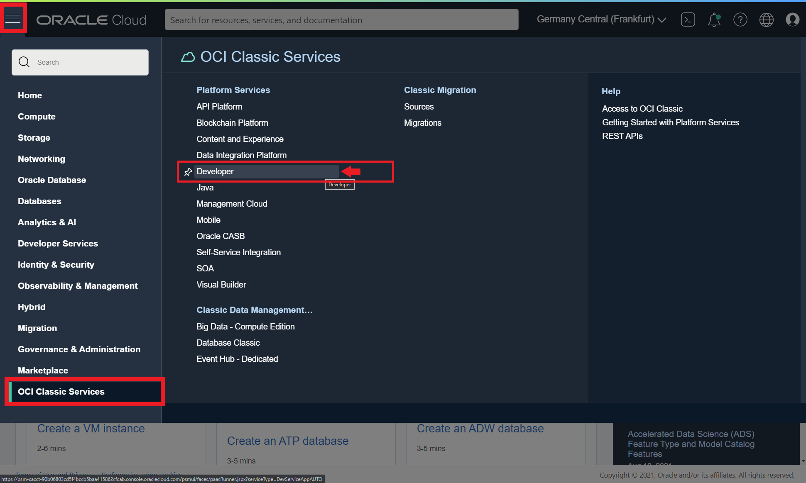
  
Next you have to click in the VBS instance **menu icon** and click in the **Access Service Instance**  

> Note: In case there is no instance yet created, create a new instance, wait until gets created, and access to it. 
	
> IMPORTANT: Save the URL of this Visual Builder Studio instance, as it will be used in the following chapters.
  
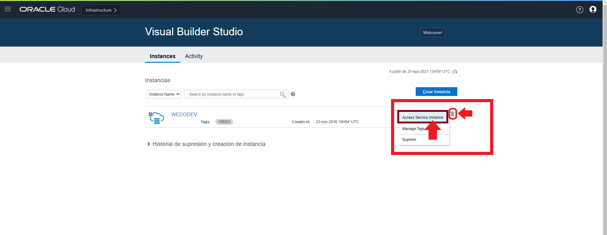  

</details>
<details>
  
  <summary>2. Import the provided application into Visual Builder Studio (click to show)</summary>
  
## 2. Import the provided application into Visual Builder Studio

First step inside Visual Builder studio is create a project. It can be done pushing the ***+ Create*** button in the default page (***Organization***) where you land first time you access to Visual Builder Studio. 

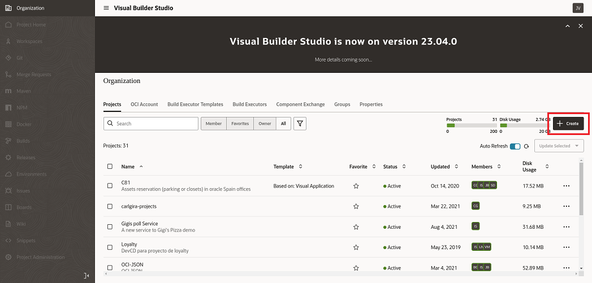

Give a Name to the project and push the ***Next*** button

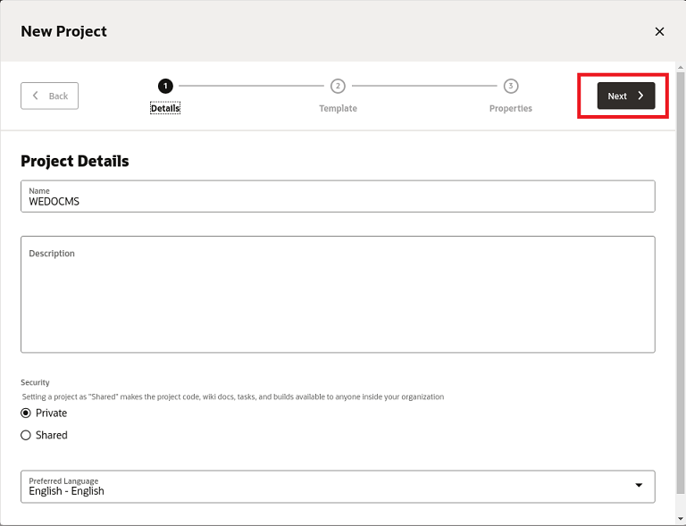
	
As we will import an existing Visual Builder Appication, as a Project Template select an ***Empty Project*** and push the ***Next*** button.	

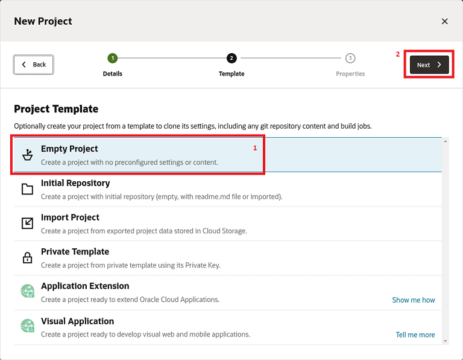

In the last screen of the wizzard, leave the defaul wiki markup language and push the ***Finish*** button. The new project will be created in no more than 5 minutes.

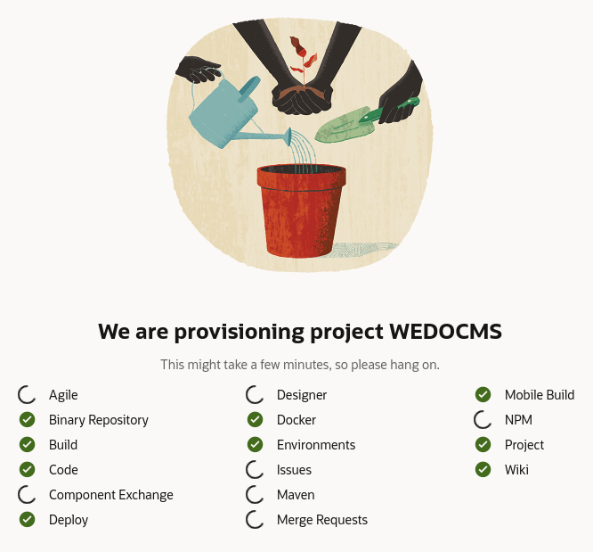

Once the Project gets created, the main page of the project will be shown. Before import our application we need to have an environment to configure and temporarilly run it. Click on the ***Create Environment*** button.

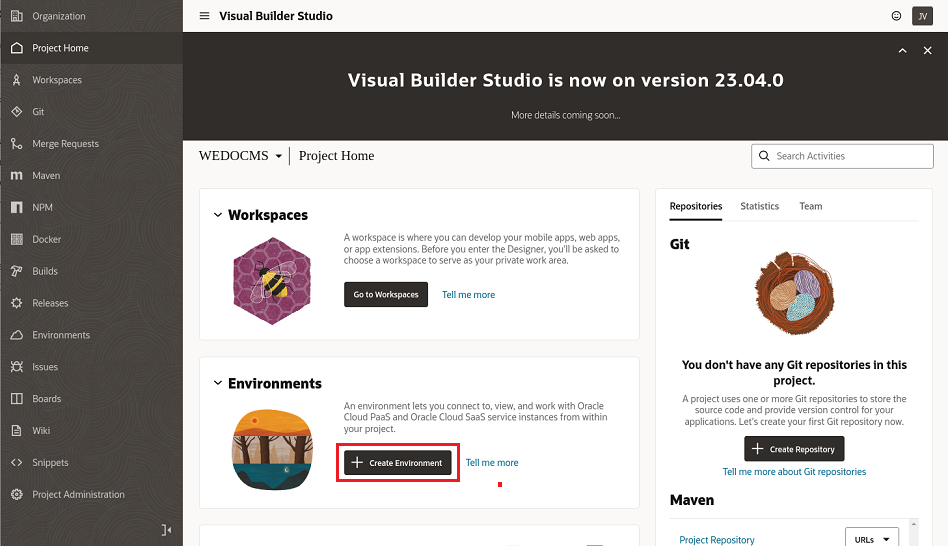

Give a name to the environment and a description and click on the ***Create*** button.

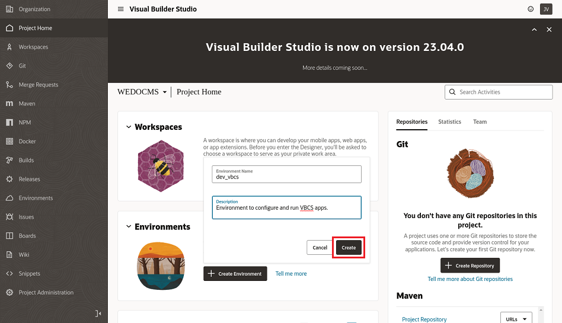

If there is any Visual Builder instance already in the tenancy, add it to this environment pushing the ***Add Instance*** button. 

>  Note: If you do not have any instance of Visual Builder, provision one and return to this point to add the instance to the Environment.

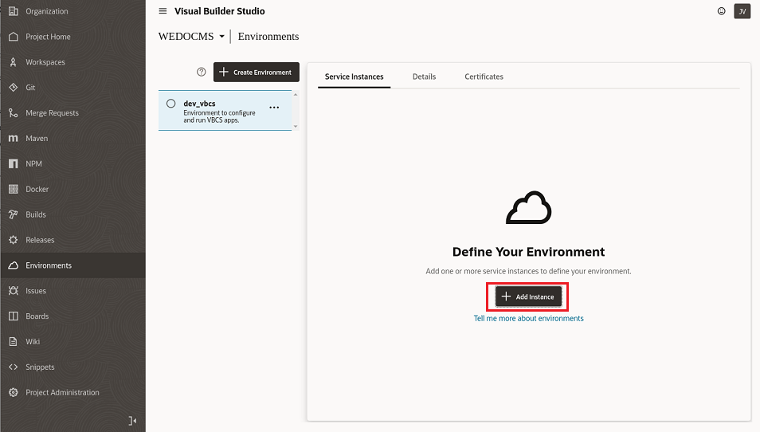

Select your VBCS instance and click on the ***Add*** Button. After that you will see how your environment with a VBCS environment tied to it are ready to be use.

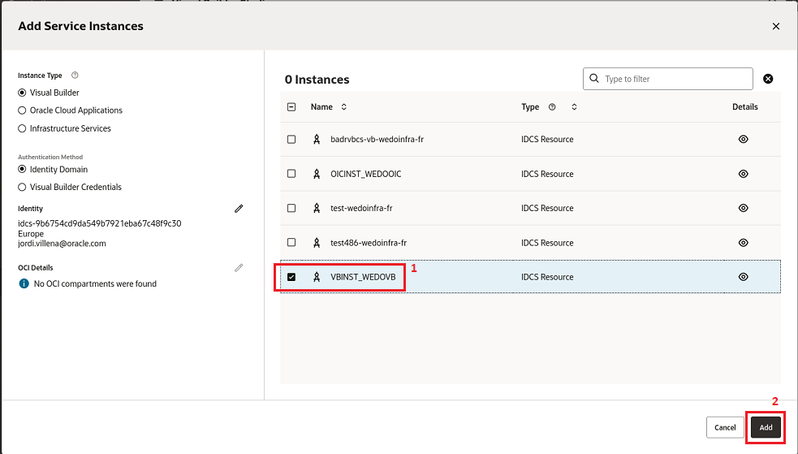

Once the environment has been added to the project, we are going to create the ***Workspace***, where we will be able to import the precreated Web Application. 

Push the ***Workspace*** menu option in the left navigation menu. 

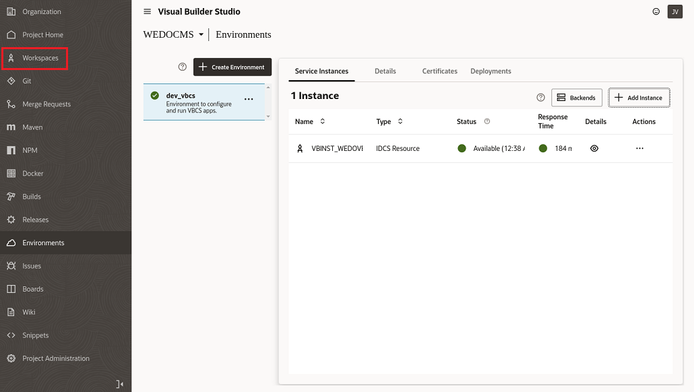

A workspace can be created just importing our VBCS Web Application into the project. Push the ***Import*** button.

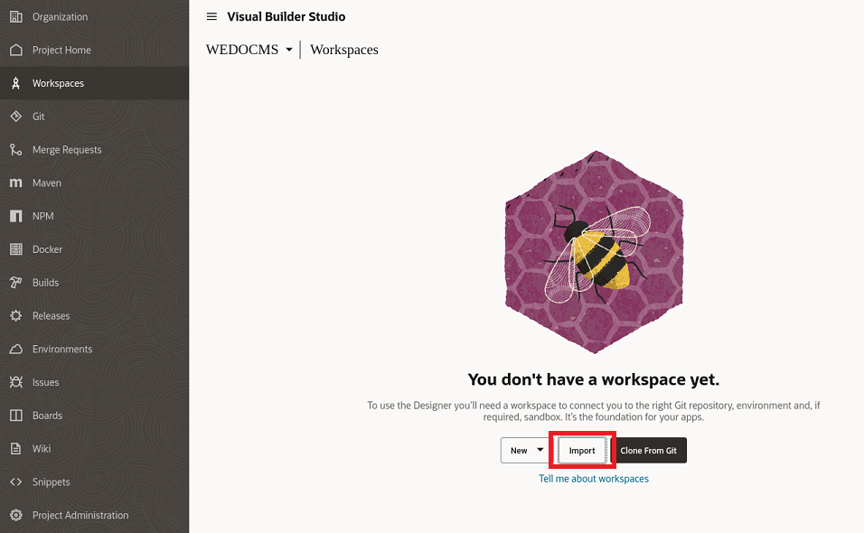

Populate the Workspace creation wizzard page by providing:   
	- The zip file of the precreated VBCS Application  
	- A name for the workspace  
	- Select the environment we configured previously into the project to be use to test the application  
	- Create a new empty Git repository giving to it a name and a default branch name  

Once provided all the details, push the ***Import*** button.

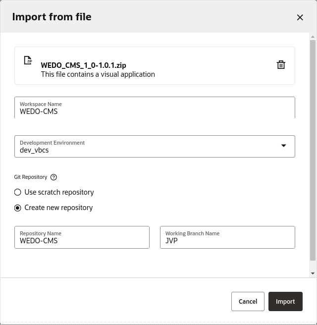
    
</details>
<details>
  <summary>3. Configure the Web Application to point to your Blockchain instance and your Storage Bucket (click to show)</summary>

## 3. Configure the Web Application to point to your Blockchain instance and your Storage Bucket
In this chapter we are going to configure the provided Web Application to point to the Blockchain Instance we created in the chapter [Create an Oracle Blockchain Network
](https://github.com/jvillenap/CMS-Secured-by-Blockchain/blob/main/1-create-network/README.md), and to point the Object Storage Bucket we created in the chapter [Creation and Configuration of the OCI Storage Bucket](https://github.com/jvillenap/CMS-Secured-by-Blockchain/blob/main/4-bucket/README.md).

<details>
  <summary>3.1 Configure the Blockchain Network (click to show)</summary>
  
### 3.1 Configure the Blockchain Network.
First of all we need to recap all the information related with the Blockchain Network we defined in the first chapter [Create an Oracle Blockchain Network
](https://github.com/jvillenap/CMS-Secured-by-Blockchain/blob/main/1-create-network/README.md). If you followed the same terminology used in the HoL, following table shows this information:

|Field|Value|  
|-|-|
|BC Endpoint | https://org1-wedoinfra-fra.blockchain.ocp.oraclecloud.com:7443/ |
|Instance Name |org1|
|Channel | wedocms |
|Chaincode | WEDOCMS |

> Note: BC Endpoint is the only value which will vary for all the tenancies because the URL is composed based in some OCI tenancy values as we can see in the following URL:

```
    https://<InstanceName>-<TenancyName>-<RegionID>.blockchain.ocp.oraclecloud.com:7443/
```

When it is clear all this information, we can move forward and configure such parameters into our Web Application. It can be done opening the workspace we just created in Visual Builder Studio. So, first of all let's open the workspace by Accessing to our [Visual Builder Studio instance](#AccessVBS), and open the project you created by clicking in the name of the project from the default page where you land  (***Organization***) when you access to VBS.

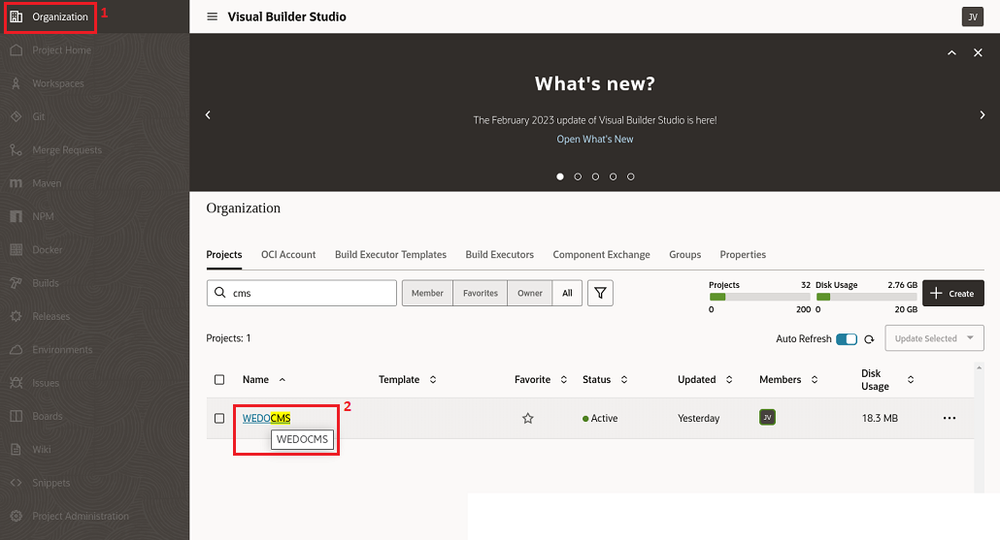

Once inside the project, select the ***Workspace*** created when importing the provided Web Application.

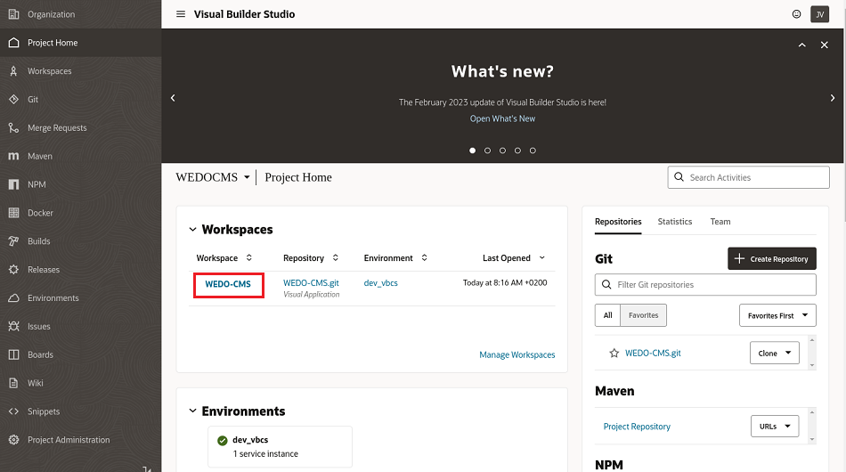

Once inside the Workspace, let's move to the place where the variables defining with which Blockchain instance, channel and chaincode our app must interact.

First select the Web App Section (1), and then select the only existing Web App ***docmngmnt***) (2).

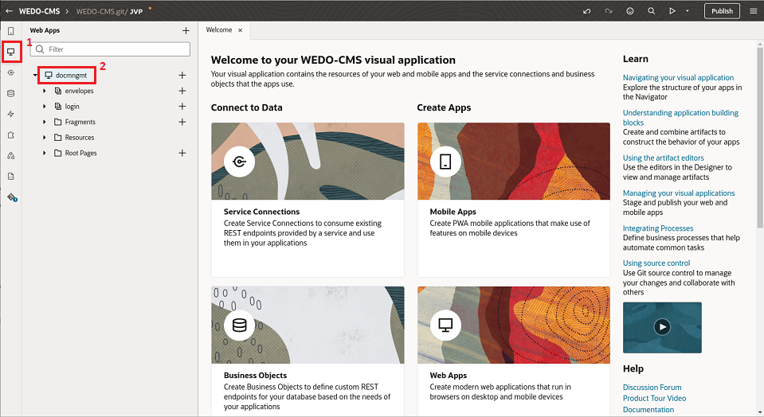

Once Opened the application, move to the ***variables*** tab.

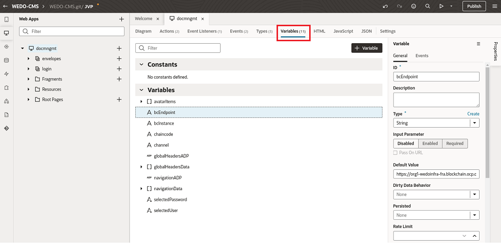
  
And change the default value of the variables ***bcEndpoint***, ***bcInstance***, ***chaincode***, and ***channel***. It can be done easily just pushing the ***f(x)*** symbol in the top-left corner of the ***Default Value*** attribute for each of the variables.

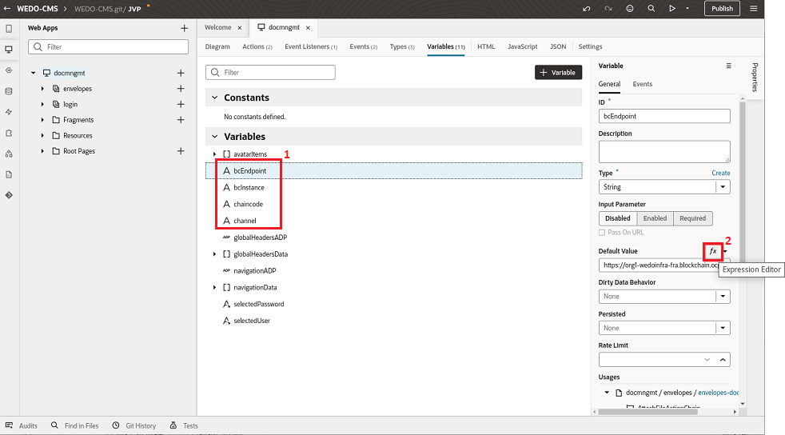

Once selected any of the variables, and when the ***f(x)*** symbol gets clicked, the expression editor will be opened, where you will be able to set propperly the value of each property based in your environment.
  
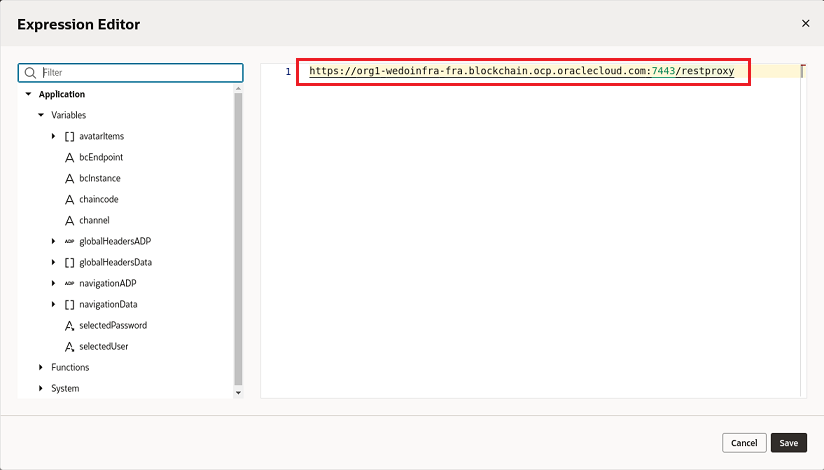

Once changed all this parameters we can move forward to the next chapter!
  
</details>
<details>
  <summary>3.2 Configure the OCI Storage Bucket (click to show)</summary>

### 3.2 Configure the OCI Storage Bucket.

Now we are going to configure the bucket to be used by the Web Application based in the values of the API Key and Bucket we created in the chapter [Creation and Configuration of the OCI Storage Bucket](https://github.com/jvillenap/CMS-Secured-by-Blockchain/blob/main/4-bucket/README.md).

First select the ***Services Connection*** Section (1), and then select the ***fileUpload*** Service Connection (2).

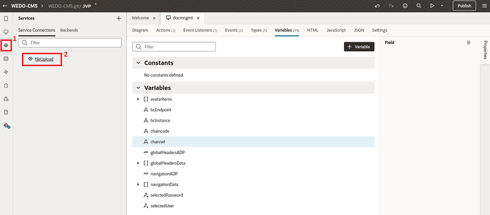

Click in the ***Servers*** tab. 
  
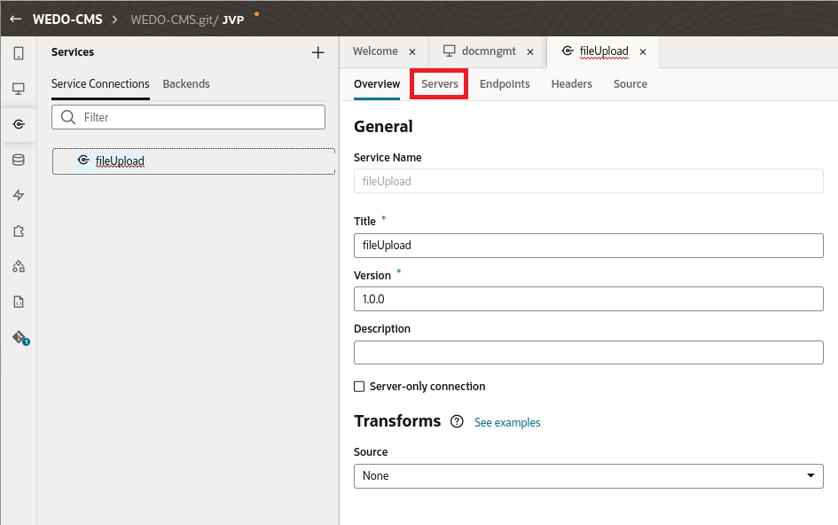
  
In the Right side of the server configuration, Click on the ***Pencil*** icon to change the configuration of the ***fileUpload*** service Connection.
  
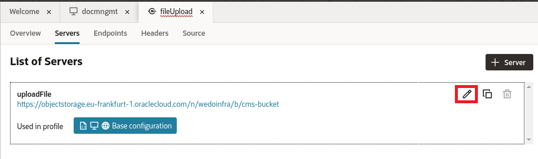

The configuration of the Service Connection used to interact with our bucket needs to be adapted in three places:

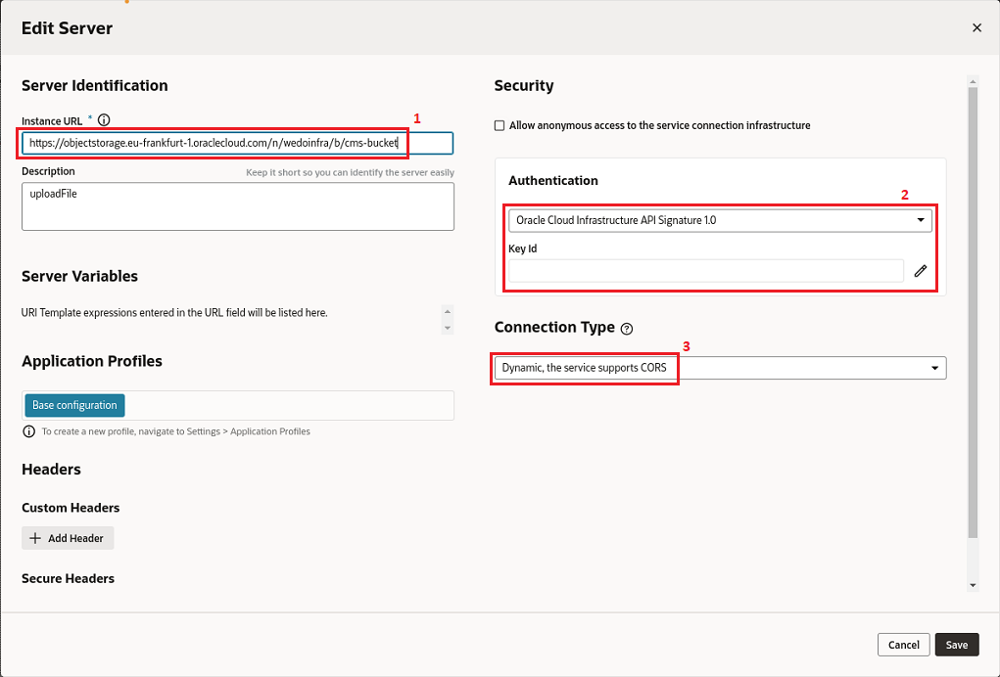

 1. ***Instance URL***: It needs to be changed to point to your Bucket based in a couple of properties from your OCI tenancy and the name you gave to the bucket when you created it. The URL must be composed based in the following URL template:
```
   https://objectstorage.<region-name>.oraclecloud.com/n/<storage-namespace>/b/<bucket-name>
```
The tenancy related values can be retrieved by accessing to the ***Tenancy Details*** Page from the OCI Console. You can reach this page from the OCI Console by pushing the ***Profile*** (1) icon in the top-right side of the console, and selecting the ***Tenancy Details*** (2) menu option:

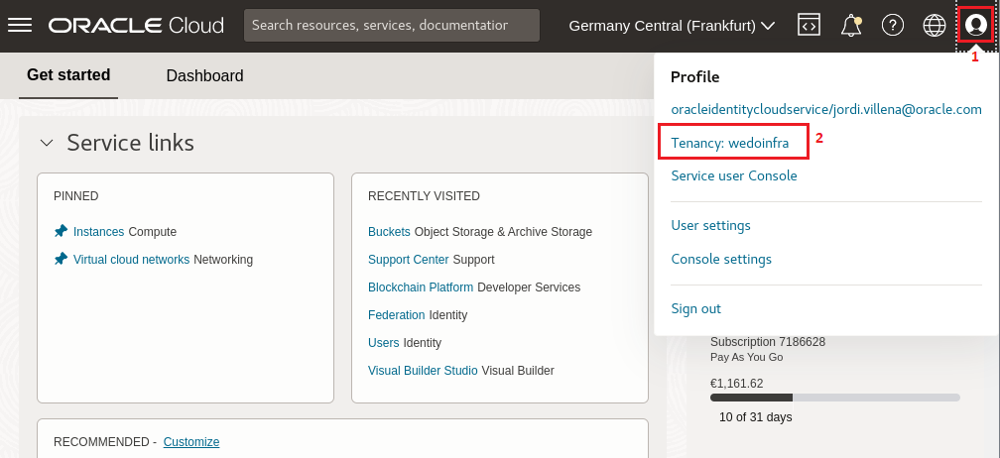

... and the values ***Region Name*** (1) and ***Object Storage Namespace*** (2) can be obtained from this page:

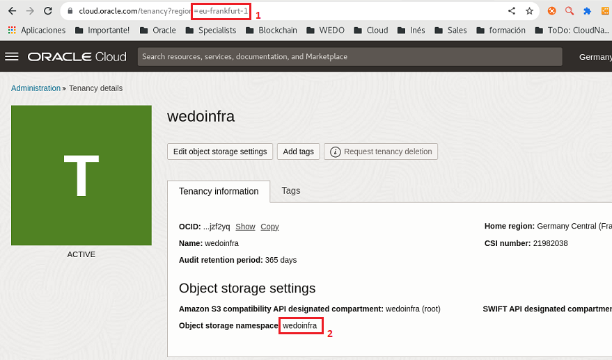

 2. ***Authentication***: You must ensure the authentication method is set to ***Oracle Cloud Infrastructure API Signature 1.0***, and the key is set by pushing the Pencil icon in the right side of the ***Key Id*** property:

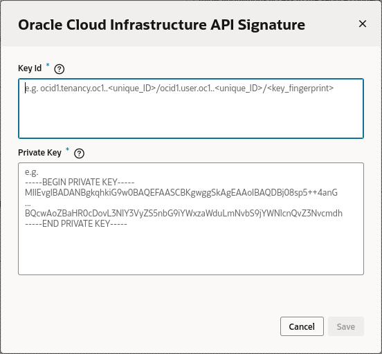

As you can see from the image, the ***Key Id*** is composed based in the following template:
```
   <Tenancy-OCID>/<User-OCID>/<Key-Fingerprint>
``` 
All this values can be obtained from the ***Configuration File Preview*** obtained when ***API Key*** was created in chapter [Creation and Configuration of the OCI Storage Bucket](https://github.com/jvillenap/CMS-Secured-by-Blockchain/blob/main/4-bucket/README.md).

***Private Key*** is the private key we Used/Generated/Downloaded (depending on the selected option) during the ***API Key*** creation.

 3. ***Connection Type***: Must be set to ***Dynamic, the service supports CORS***.

Once set all these three properties has been configured propperly accordingly with your ***Bucket*** and ***API Key***, the Web Application is completely ready to interact with your Storage Bucket.

Now, you can test the Application! 
</details>
    
</details>

<details>
  <summary>4. Test your Web Application (click to show)</summary>

## 4. Test your Web Application
Now you can test the application from the Visual Builder environment configured in our project. After we can see how everything works fine, we can move forward and export the Web Application to be deployed in an standalone box.

This Web Application interacts against the two backends used in the solution, it is Blockchain to store the expedients and the metadata of the documents, and the buckets of OCI storage for the documents content. So, we are going to test a couple of functionalities ensuring both backends (Blockchain and Bucket) are accessible through the Web Application.

To test the application, push the ***Preview*** icon in the top-right corner of the Visual Studio Workspace.

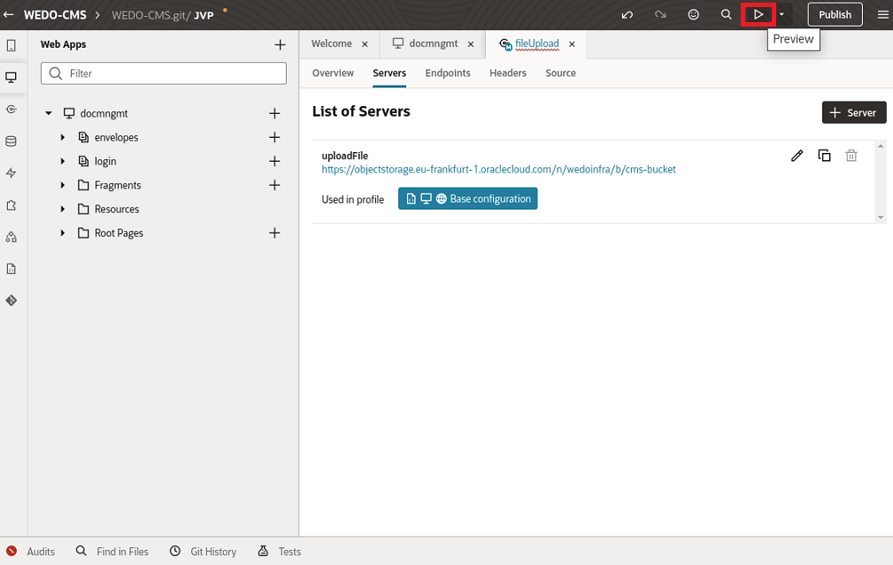

Login into the application as an expedient manager, the user will be able to access to the expedients for which he/she is the current owner, 
	... or create a new expedient, for which he/she will be the current custodian.
	being able to add more documents into the expedient, or transfer the whole expedient to a different user/department.

Let's try to create an expedient, and upload a document to it.

First of all login as one of the users (cmsleg001, cmsfin001, or cmsrsk001) ensuring the role is set to ***Expedient Manager***, and push the ***Login*** button.

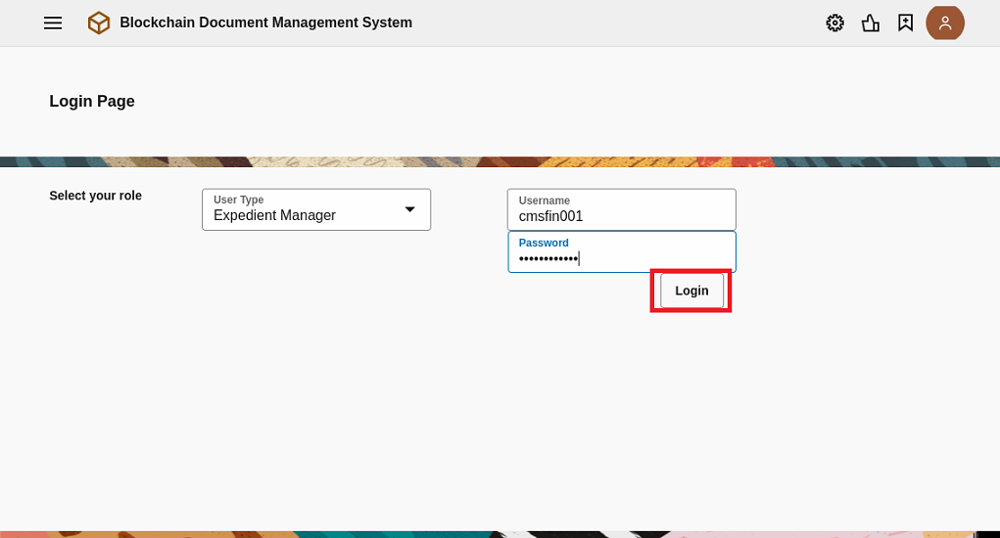

In the ***Expedient Management*** page, push the ***New Expedient*** button.


Assign values to the three input fields (***Expedient Type***, ***Description***, and ***Customer ID***) and click in the ***Create Expedient*** button.

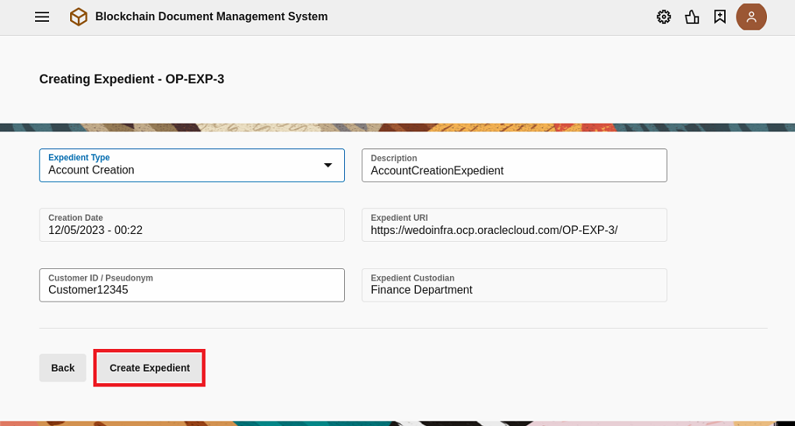

In a few seconds, if the transctions is commited following message should appear in the page:

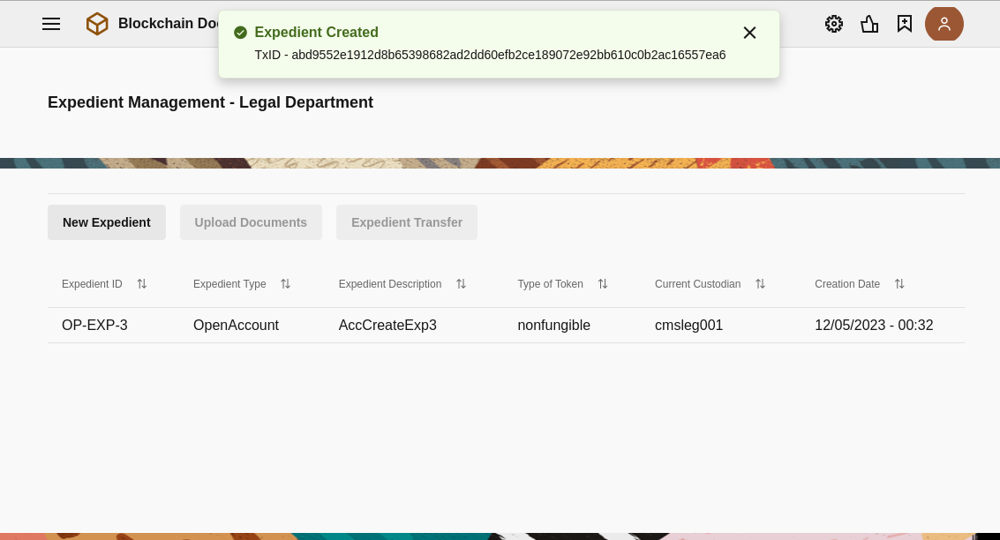

We can double-check if the transaction has been executed properly accessing to the ***Oracle Blockchain Service console***, navigate to the ***Channels*** tab, select the ***wedocms*** channel, and check the content on the last block save into the ledger. It should contain the request to execute the transaction we have just executed:

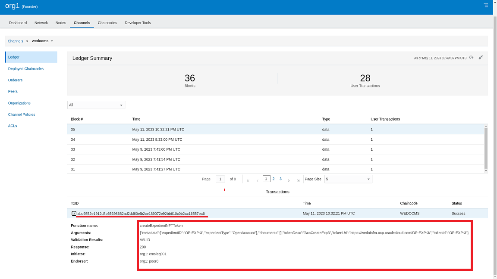

Now, let's see if we can upload a document into the newly created expedient.

Select the expedient we just created (1) and push the button ***Upload Documents*** (2).

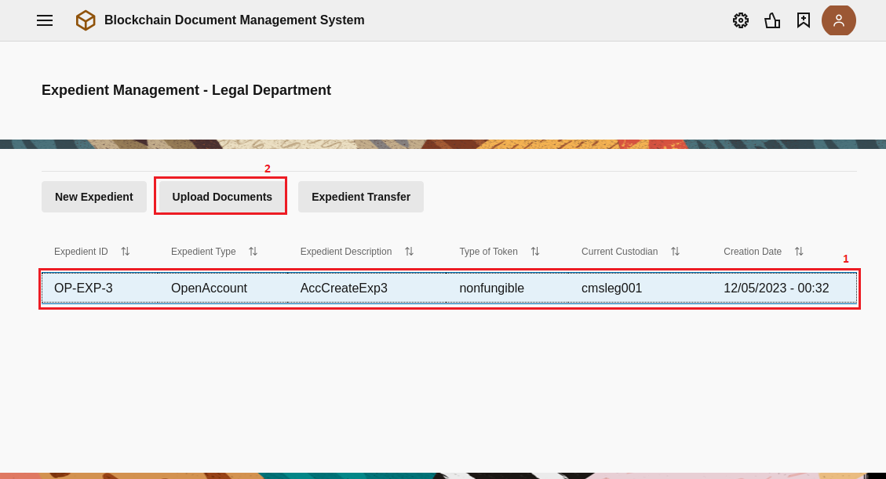

There is no document uploaded in this expedient. Click the ***Upload a New Docuemnt*** button.

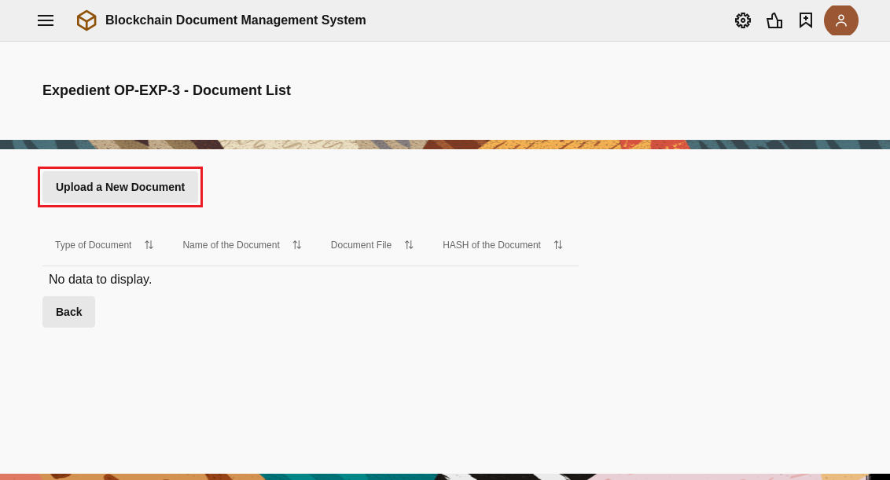

Select a ***Document Type*** (1), give a value to the ***Document Name*** field (2), drag a PDF file into the ***Drag on Drop*** Area (3), add as much ***Dynamic*** key-value properties (4), and click the ***Upload Document*** Button. 

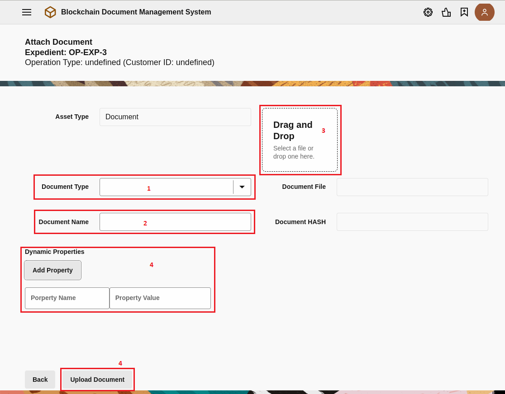

If the document gets uploaded properly, following confirmation message should appear:

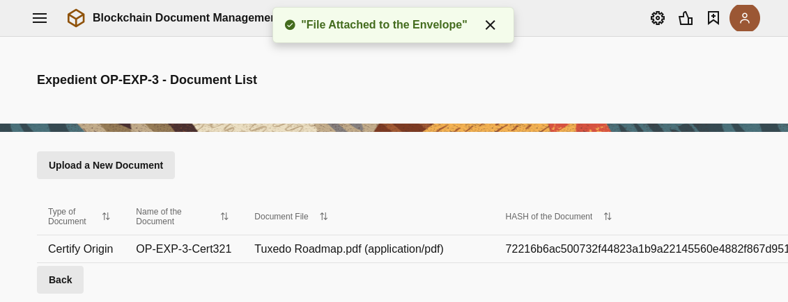

We can review again in the ***Oracle Blockchain console*** if this new transaction has been executed, and also if the document has been uploaded into the OCI Storage Bucket:

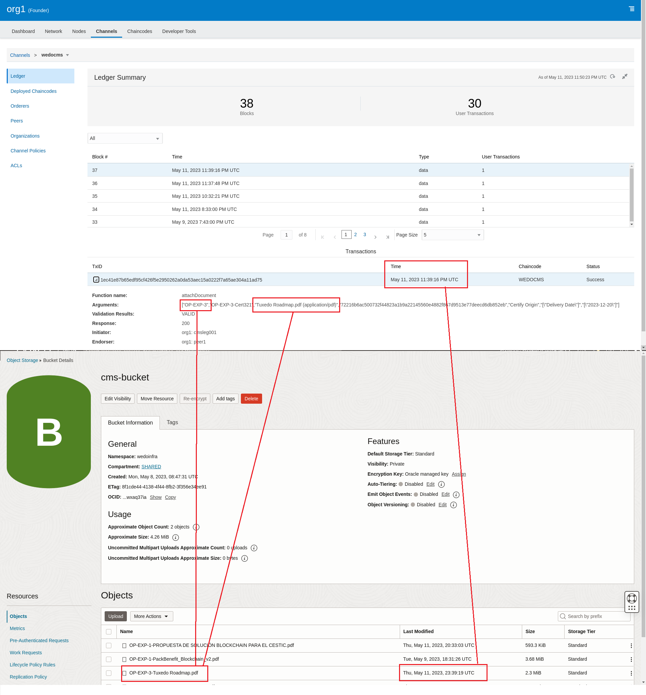

Login as a document reviewer, any user who has access to the app will be able to review documents uploaded from any expedient.

</details>
<details>
  <summary>5. Export the application to be executed in a standalone machine (click to show)</summary>

## 5. Export the application to be executed in a standalone machine
A Visual Builder application if meets some conditions, can be executed outside of the context of Visual Builder. To see what conditions must meet the application to be able to run outside of Visual Builder instance, check the following blogs:
	
1. [Running Visual Builder Apps On Other Servers (and On-Premises)](https://blogs.oracle.com/vbcs/post/running-visual-builder-apps-on-other-servers-and-on-premises)
	
2. [Running Visual Builder Apps Outside of Visual Builder](https://blogs.oracle.com/vbcs/post/vboutside)

To perform the export of the application, first of all we must push the changes into the Git Repository. It can be done by clicking on the ***Git Repo/Branch*** menu (1) from the upper-left side of the Workspace, and selecting the ***Push*** option (2) from the menu.

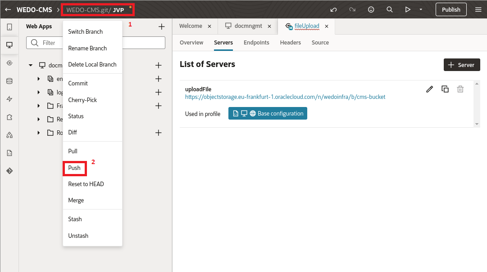

Write a message about the performed changes, and click on the ***Commit all and Push*** button.

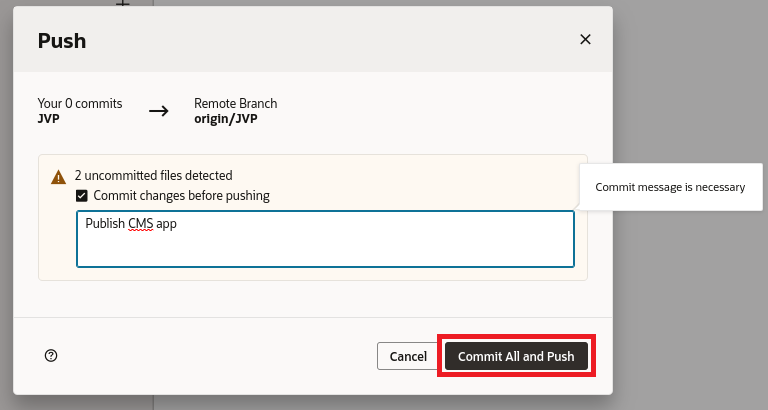

First time this job is executed, it use to take several minutes waitting for a ***Build Executor***, but once the ***Build Executor*** picks up the job, it should be executed in no more than 3 minutes.

Folowing pop-up message should appear un a few seconds:

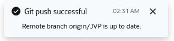

At this point we can publish our application, and this action will trigger a build job to optimize the application to be executed in the best conditions. We can publish the application by clicking the ***Publish*** button in the top-right corner of the Workspace page:

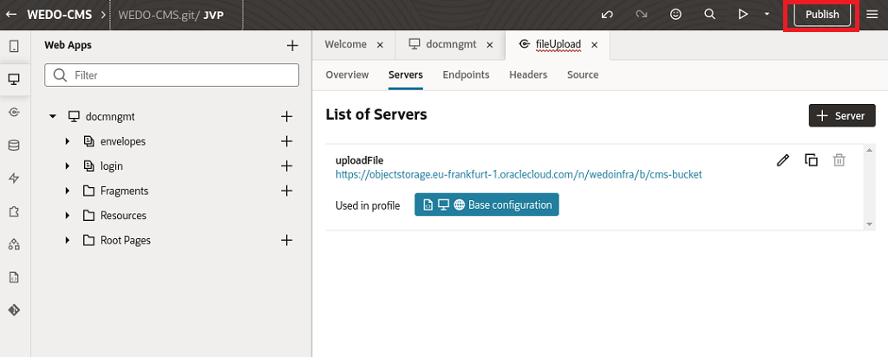

You will be asked to decide the merge policy for the changes done in the application, and after that you should click the ***Publish button***.

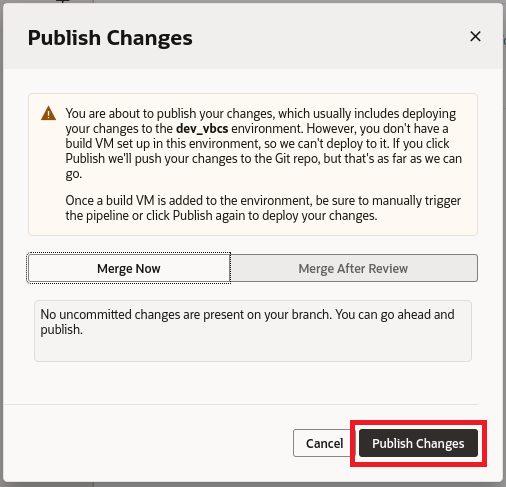

You will be asked to provide your credentials:

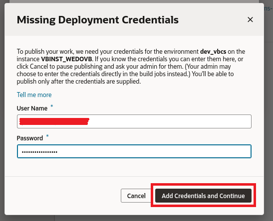

After pushing the button ***Add Credentials and Continue*** and following pop-up will appear:

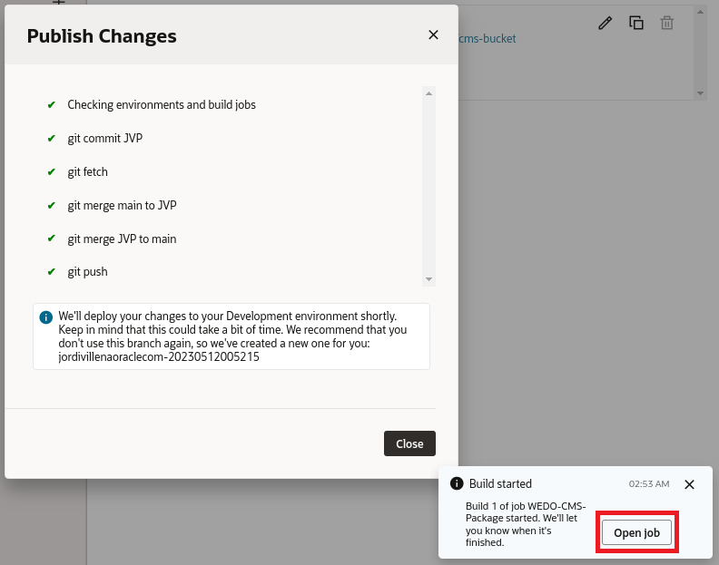

Clicking in the ***Open Job*** button, we will be reirected to the ***Build*** Section of Visual Builder Studio, where we will be able to see which is the status of the generation of the build package to be used to be deployed externally.

< NOTE: Completion of the build job should not take more than 2-3 minutes, although the job could take longer in case there is no ***Build Executor*** ready to pickup our job. It can occur if this is the first time we execute the job, because the Build Executor is creating or starting.

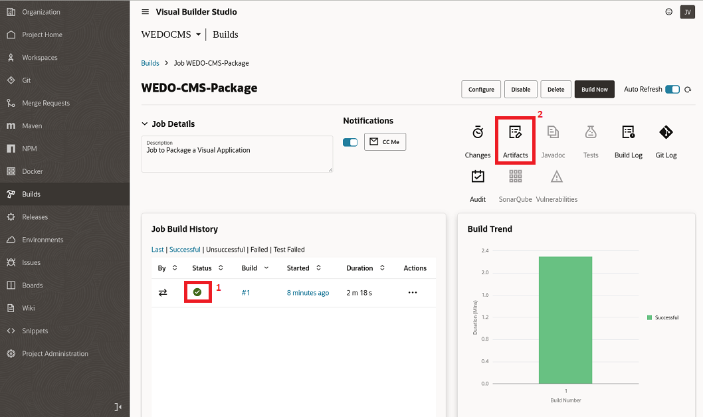

In this page we can see if the job has been execute properly (1), and going to the ***Artifacts***, we will be able to see the generated package. 

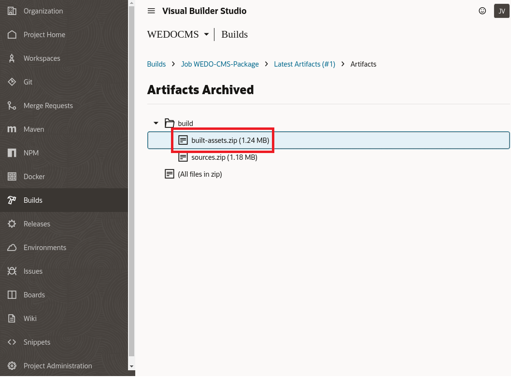
       
Clicking on ***build-assets.zip*** the package will be downloaded into our machine, so the exportable package is ready to be deployed outside of Visual Builder!

</details>
<details>
  <summary>6. Execute the exported package into an Apache Tomcat Server (click to show)</summary>

## 6. Execute the exported package into an Apache Tomcat
The ***built-assets.zip*** package can be deployed to be served directly by an Apache Tomcat Server. Here you have the steps to do it:
---
> IMPORTANT: ....	Apache NGINX....
---

First of all you need to install Apache Tomcat Server in your laptop, once installed, start it and check it works by trying to access to the URL: http://localhost:8080

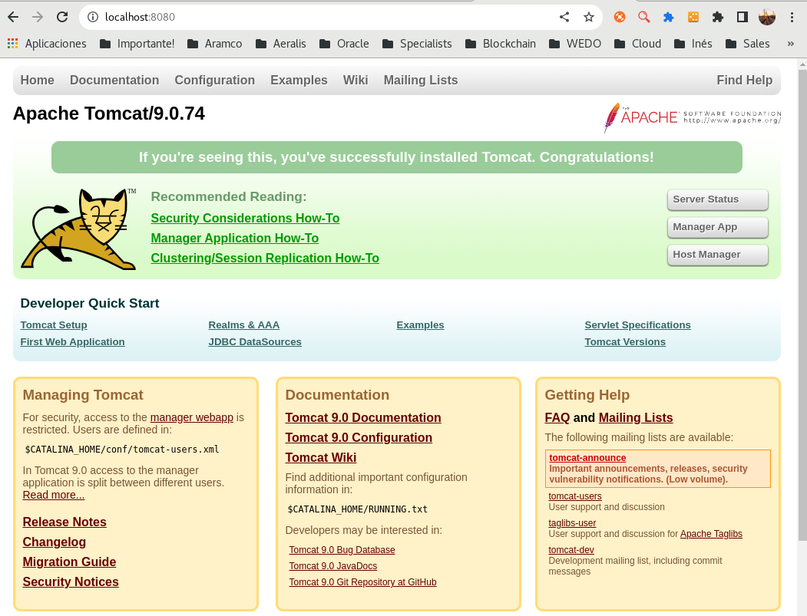

If you see the previous page, you are ready to install our Web Application in this Tomcat installation.

Our application can be installed in Tommcat just decompressing the ***built-assets.zip*** package, and copying the content of the zip into a new folder created inside the ***<ApacheHome>/webapps*** folder.
```
	cd /installed/apache-tomcat-9.0.74/webapps
	mkdir WEDOCMS
	cd WEDOCMS
	unzip ~/Descargas/built-assets.zip
```

Once deployed our application inside the webapps foler of our Tomcat installation, we can restart Tomcat, and try to access to the following URL:
```
	http://localhost:8080/WEDOCMS/webApps/docmngmt/
```
Now we can test the application in our local environment!
</details>
